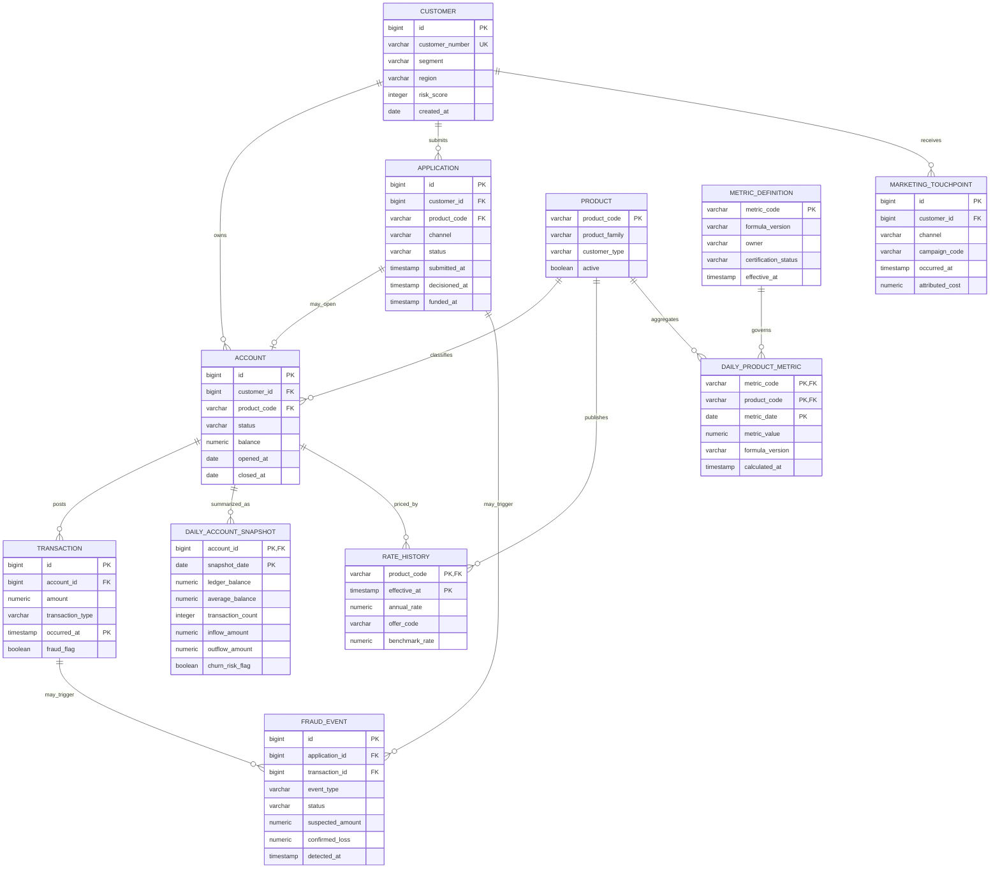

# Banking Analytics Data Model

This document defines the current demo schema and the recommended production model needed to calculate the dashboard metrics. The model separates stable master data, event history, governed metric facts, and operational telemetry.

## Domain model

## Current demo tables

The running demo uses three physical tables:

| Table | Purpose | Storage |
|---|---|---|
| `customers` | Synthetic customer master with segment, region, and risk score | Standard PostgreSQL table |
| `accounts` | Product relationship and current balance | Standard PostgreSQL table |
| `transactions` | Dated deposits and payments | TimescaleDB hypertable partitioned by `occurred_at` |

The remaining dashboard metrics are currently deterministic demo values returned by the `DemoMetricsRepository` adapter. The repository port deliberately isolates that demo source from the application and HTTP layers, but it must be replaced by governed production facts before company use. Seeded transactions demonstrate storage and volume; they do not currently drive every displayed KPI.

Schema changes are versioned under `server/src/main/resources/db/migration` and applied by Flyway. Application startup does not use Hibernate schema mutation.

## Recommended production tables

| Table | Grain | Why it exists |
|---|---|---|
| `products` | One row per product code and version | Separates business/consumer and checking/savings definitions from display labels |
| `applications` | One row per submitted product application | Supports application, approval, funding, channel, and activation funnels |
| `daily_account_snapshots` | One account per business date | Supports certified balances, net flows, dormancy, retention, and churn features |
| `rate_history` | One product/offer per effective timestamp | Supports rate paid, deposit beta, promotion, and sensitivity analysis |
| `marketing_touchpoints` | One customer interaction per timestamp | Supports channel conversion, attribution, and CAC |
| `fraud_events` | One fraud alert or confirmed case | Separates suspected events, confirmed fraud, recoveries, and realized loss |
| `metric_definitions` | One metric/formula version | Provides ownership, lineage, effective dates, and certification |
| `daily_product_metrics` | One metric/product/business date | Serves fast governed dashboard reads and historical formula versions |
| `technology_metric_samples` | One service/metric/timestamp | Supports availability, latency, freshness, and pipeline-health views |

## TimescaleDB hypertables

Use hypertables for append-heavy data queried by time range:

- `transactions` partitioned by `occurred_at`.
- `marketing_touchpoints` partitioned by `occurred_at` when volume justifies it.
- `rate_history` partitioned by `effective_at` for large offer-level pricing history.
- `technology_metric_samples` partitioned by `observed_at`.

Keep customers, products, accounts, applications, metric definitions, and current reference data as ordinary relational tables. Choose chunk intervals from measured ingest volume and the most common reporting window rather than a fixed default.

## Metric lineage

| Dashboard metric | Primary facts | Required dimensions |
|---|---|---|
| Total deposits | `daily_account_snapshots.ledger_balance` | Product, customer type, region, business date |
| Net new money | External transaction inflows and outflows | Product, channel, transaction classification |
| Net interest margin | Finance interest income/expense and average earning assets | Legal entity, product, month |
| Fraud loss rate | `fraud_events.confirmed_loss` and eligible transaction value | Product, payment type, date |
| Application funnel | `applications` timestamps and status | Product, channel, customer type, cohort |
| Marketing CAC | `marketing_touchpoints.attributed_cost` and funded customers | Campaign, channel, product, cohort |
| Deposit beta | `rate_history.annual_rate` and benchmark-rate history | Product, customer tier, rate cycle |
| Churn and balances at risk | Account closures, snapshots, and approved model output | Product, cohort, risk band |
| Checking engagement | Transactions, direct deposit, card and treasury flags | Checking subtype, customer type |
| Savings behavior | Snapshots, recurring transfers, goals, and rate history | Savings subtype, balance tier |
| Technology health | `technology_metric_samples` | Service, endpoint, environment, region |

## Keys and identity

- Keep source-system identifiers in dedicated columns and issue internal surrogate keys for cross-source joins.
- Maintain an identity crosswalk when a customer has multiple source identifiers.
- Use immutable event identifiers plus event timestamps for deduplication.
- TimescaleDB unique indexes on hypertables must include the time-partitioning column.
- Never use email, phone number, or government identifiers as primary keys.

## Security classifications

| Classification | Examples | Minimum controls |
|---|---|---|
| Restricted customer data | Customer identity crosswalk, account numbers | Tokenization, field encryption, strict role access, audit logging |
| Confidential financial data | Balances, transactions, fraud cases | TLS, encryption at rest, least privilege, retention policy |
| Internal operational data | API latency, pipeline status | Environment isolation and operational role access |
| Approved aggregates | Certified product-level metrics | Governed publication and formula versioning |

Production analytics should use tokenized customer keys and masked account references unless clear-text access is explicitly approved.

## Data-quality controls

- Customer numbers and source event IDs must be unique within their source scope.
- Account balances must reconcile to approved core-banking control totals.
- Transaction timestamps, currency, reversal status, and internal-transfer classification are mandatory for flow metrics.
- Application states must follow a controlled state transition model.
- Every daily aggregate must record calculation time, source watermark, and formula version.
- Late-arriving events must trigger a documented restatement policy rather than silently changing certified history.
