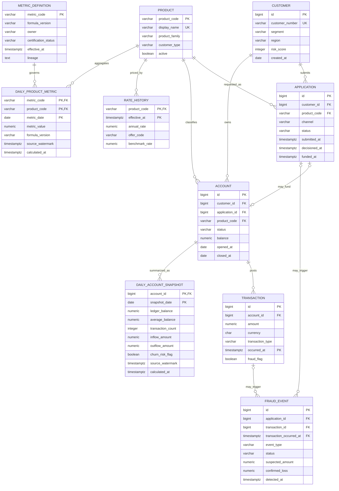

# Banking analytics data model

Northstar separates operational banking records from analytical read models. Java domain types enforce core invariants; Flyway owns the corresponding demo persistence schema. Dashboard values remain synthetic and `DEMO`-certified.

## Implemented model

## Code and persistence alignment

| Concept | Java model | Persistence / role | State |
|---|---|---|---|
| Customer | `Customer` with segment, identity, region, and risk-score range | `customers` | Implemented and seeded |
| Product | `Product` with code/family/customer type/active state | `products` | Implemented and seeded catalog |
| Application | `ProductApplication` with channel/state timestamp invariants | `applications` | Implemented and seeded |
| Deposit account | `DepositAccount` with balance and closure invariants | `accounts`; focused `AccountRepository` | Implemented and seeded |
| Transaction | `BankingTransaction` and `Money`; external-flow semantics | `transactions`; focused `TransactionRepository` | Implemented, seeded, Timescale hypertable |
| Fraud | `FraudEvent` with source and loss invariants | `fraud_events` | Implemented and seeded from flagged transactions |
| Pricing | `RateHistoryEntry` with non-negative rates | `rate_history` | Implemented, seeded, Timescale hypertable |
| Account analytics | `DailyAccountSnapshot` with non-negative aggregates | `daily_account_snapshots` | Implemented projection and seeded daily grain |
| Governed metrics | `GovernedMetric.Definition` / `DailyValue` with certification, lineage, formula version, and watermark | `metric_definitions`, `daily_product_metrics`; focused `MetricDefinitionRepository` | Implemented projection; demo-certified |
| Dashboard projection | `PortfolioMetrics` scoped by `PortfolioScope` | `AnalyticsProjectionRepository` | Deterministic demo adapter; production source deferred |

`AccountActivityService` demonstrates an operational use case across account and transaction ports. `MetricLineageService` queries governed definitions. `MetricsQueryService` stays on the CQRS-style analytical projection boundary and maps to API DTOs separately.

## Invariants and data quality

- Risk scores are 300–850; customer/product identity is required and unique in persistence.
- Deposit balances and snapshot measures cannot be negative. Closed accounts require a valid close date.
- Transaction amounts are positive, carry currency, immutable event time, and a type that distinguishes internal transfers from external flows.
- Application decisions cannot precede submission; funded applications require decision and funding timestamps.
- Fraud events must reference an application or transaction; confirmed loss cannot exceed suspected amount.
- Rates cannot be negative. Hypertable uniqueness includes the time partition.
- Governed values record metric/formula version, calculation time, source watermark, owner, certification state, and human-readable lineage.
- Demo aggregate facts are explicitly `DEMO`; they are not finance-certified.

## Storage choices

`transactions` and `rate_history` are TimescaleDB hypertables because they are append-heavy and time-window queried. Customer, product, application, account, fraud investigation, metric-definition, daily snapshot, and daily aggregate tables remain relational at current volume. Add hypertables only from measured ingest/query needs, with tested chunk, compression, retention, backup, and restore policies.

## Metric lineage

| Dashboard metric | Intended authoritative facts | Required dimensions / controls |
|---|---|---|
| Total deposits | `daily_account_snapshots.ledger_balance` | Product, customer type, region, business date; ledger reconciliation |
| Net new money | External transaction inflows/outflows | Transfer classification, reversals, currency, date |
| Fraud loss rate | `fraud_events.confirmed_loss` / eligible transaction value | Case status, payment type, product, date |
| Application funnel | Application lifecycle timestamps/status | Product, channel, cohort, deduplication |
| Deposit beta/rate paid | `rate_history` plus balance-weighted snapshots | Benchmark, offer, tier, rate-cycle policy |
| Churn/balances at risk | Account state and approved model output in snapshots | Model/version/threshold, cohort, intervention |
| Dashboard metric value | `daily_product_metrics` joined to definition | Formula version, watermark, certification, owner |

## Intentionally deferred enterprise extensions

Marketing touchpoints/CAC attribution, technology metric samples, multi-currency FX valuation, reversals/chargebacks, joint ownership, customer identity crosswalk, interest accrual, general-ledger feeds, model feature/decision stores, audit ledger, and CDC are documented integration work—not pretend implementations. Add them with migrations, domain semantics, ownership, retention, authorization, lineage, and reconciliation before claiming coverage.

## Data classification

Customer identity crosswalks and account identifiers are restricted; balances, transactions, applications, pricing, and fraud cases are confidential; operational telemetry is internal; only approved aggregates should be broadly consumable. Production adaptations require tokenized identifiers, field/transport/storage encryption, purpose-limited authorization, immutable access auditing, retention/deletion/legal-hold controls, data residency review, and masking in lower environments. Never use email, phone, or government identifiers as database keys.
